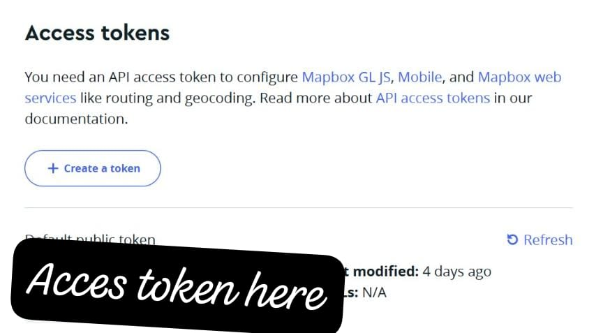
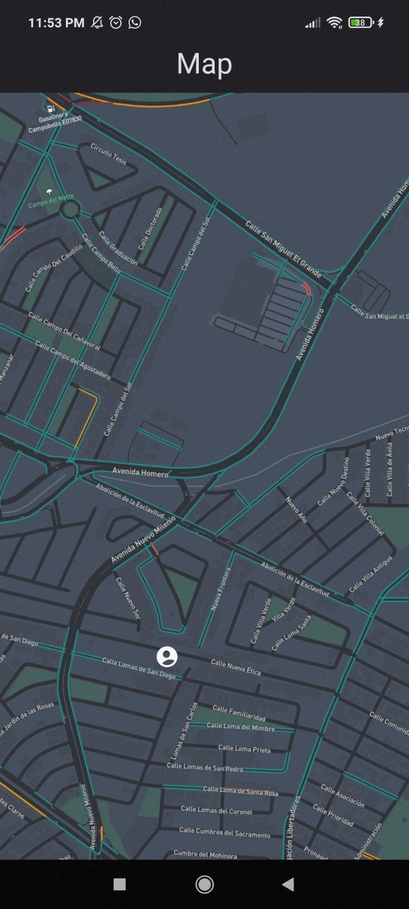
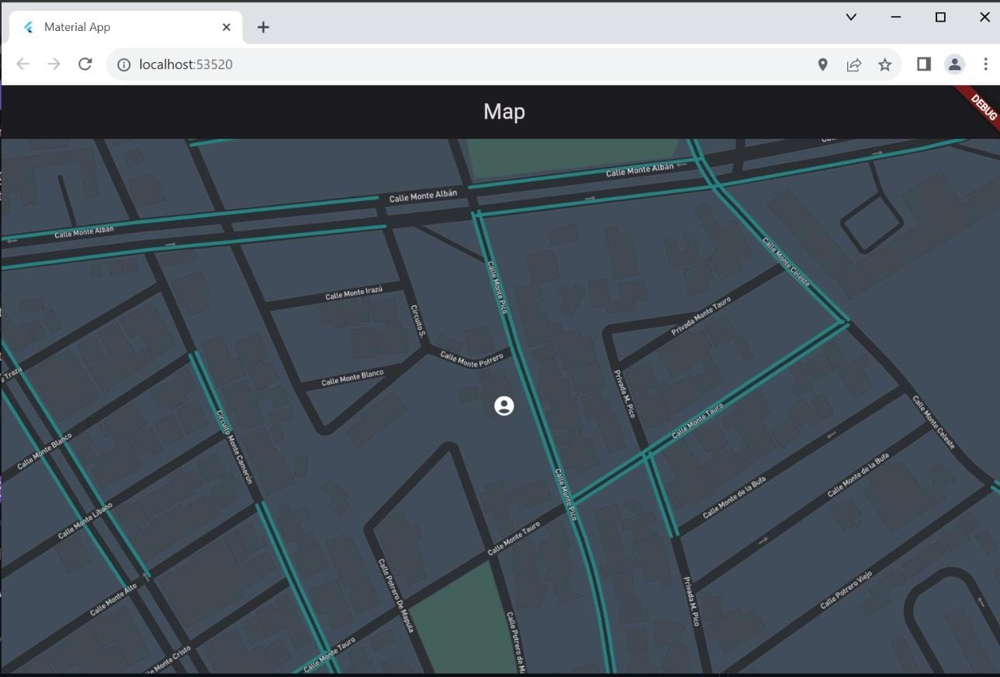

# map_flutter

A new Flutter project, that fetch data from Mapbox API.

# Mapbox
You must register your account on Mapbox website to generate a key in order to use they service.

## Screenshots

Once you get the key, you can use the funtionalities of the app!!!

# Contributing
Contributions are welcome! If you find any issues or have suggestions for improvements, feel free to open an issue or submit a pull request.

# Credits
This application utilizes the Mapbox SDK for Flutter. Special thanks to the Mapbox team for providing the tools and resources to integrate interactive maps into Flutter applications.

## Getting Started

This project is a starting point for a Flutter application.

A few resources to get you started if this is your first Flutter project:

- [Lab: Write your first Flutter app](https://docs.flutter.dev/get-started/codelab)
- [Cookbook: Useful Flutter samples](https://docs.flutter.dev/cookbook)

For help getting started with Flutter development, view the
[online documentation](https://docs.flutter.dev/), which offers tutorials,
samples, guidance on mobile development, and a full API reference.
=======
# Flutter-Maps

